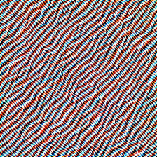

# NEB algorithm for Feature Visualization
## One example

<html>
  <video id="neb_example_12_add_1" width="500" height="200" preload="none" controls loop>
     <source src="mobilenet_v2_visualizations/videos/thesis_examples/12_add_1_naix_lucid.mp4"  type="video/mp4">
  </video>
</html>

## Another example
<html>
  <video id="neb_example_12_add_32" width="500" height="200" preload="none" controls loop>
     <source src="mobilenet_v2_visualizations/videos/thesis_examples/12_add_32_naive_tv.mp4"  type="video/mp4">
  </video>
</html>

## Multiple Starting Images
<html>
  <video id="neb_example_12_add_33" width="500" height="200" preload="none" controls loop>
     <source src="mobilenet_v2_visualizations/videos/thesis_examples/neb_block_12_add33.mp4"  type="video/mp4">
  </video>
</html>

## A bad example
The total variation penalty does not work for this feature map.
<html>
  <video  id="neb_example_2_add_6_tv" width="500" height="200" preload="none" controls loop>
     <source src="mobilenet_v2_visualizations/videos/thesis_examples/block_2_add6_tv.mp4"  type="video/mp4">
  </video>
</html>

## Still bad
Without the video is still very noisy
<html>
  <video id="neb_example_2_add_6_notv" width="500" height="200" preload="none" controls loop>
     <source src="mobilenet_v2_visualizations/videos/thesis_examples/block_2_add6_notv.mp4"  type="video/mp4">
  </video>
</html>

# MobileNetV2 Visualizations
Visualizations of different features of MobileNetV2
## Edges
The feature detectors in block 1 seem to respond to different kinds of edges. No total variation penalty was used to create the following videos, as it is counterproductive for edges.
<html>

<head>
  <link rel="stylesheet" href="styles.css">
</head>

<body>

  

    
     <header class="entry-header">
        <h4>Block_1_project_BN, unit 1</h4>
    </header>
  

  

    
    <header class="entry-header">
        <h4>Block_1_project_BN, unit 2</h4>
    </header>
  

  

    
    <header class="entry-header">
        <h4>Block_1_project_BN, unit 3</h4>
    </header>
  

  

    
    <header class="entry-header">
        <h4>Block_1_project_BN, unit 9</h4>
    </header>
  

  

    
    <header class="entry-header">
        <h4>Block_1_project_BN, unit 20</h4>
    </header>
  

  

    
    <header class="entry-header">
        <h4>Block_1_project_BN, unit 22</h4>
    </header>
  

  

    

      <video width="500" height="200" preload="none" poster="mobilenet_v2_visualizations/images/block_1_project_BN/1_lucid.png" controls loop>
        <source src="mobilenet_v2_visualizations/videos/edges/block_1_project_BN1_1.mp4"  type="video/mp4">
      </video>
    

  

 

      

        <video width="500" height="200" preload="none" poster="mobilenet_v2_visualizations/images/block_1_project_BN/20_lucid.png" controls loop>
          <source src="mobilenet_v2_visualizations/videos/edges/block_1_project_BN20_1.mp4"  type="video/mp4">
        </video>
       

   

  

    

      <video width="500" height="200" preload="none" poster="mobilenet_v2_visualizations/images/block_1_project_BN/22_lucid.png" controls loop>
        <source src="mobilenet_v2_visualizations/videos/edges/block_1_project_BN22_1.mp4"  type="video/mp4">
      </video>
     

  

   

      

        <video width="500" height="200" preload="none" poster="mobilenet_v2_visualizations/images/block_1_project_BN/2_lucid.png" controls loop>
          <source src="mobilenet_v2_visualizations/videos/edges/block_1_project_BN2_1.mp4"  type="video/mp4">
        </video>
       

    

  

      

        <video width="500" height="200" preload="none" poster="mobilenet_v2_visualizations/images/block_1_project_BN/3_lucid.png" controls loop>
          <source src="mobilenet_v2_visualizations/videos/edges/block_1_project_BN3_1.mp4"  type="video/mp4">
        </video>
       

   

  

    

      <video width="500" height="200" preload="none" poster="mobilenet_v2_visualizations/images/block_1_project_BN/9_lucid.png" controls loop>
        <source src="mobilenet_v2_visualizations/videos/edges/block_1_project_BN9_1.mp4"  type="video/mp4">
      </video>
     

  

</body>
</html>
 
## Textures

The features of the following blocks are more plastic and show textures

<html>

<head>
  <link rel="stylesheet" href="styles.css">
</head>

<body>
  

  

    
     <header class="entry-header">
        <h4>Block_3_project_BN, unit 6</h4>
    </header>
  

  

    
    <header class="entry-header">
        <h4>Block_3_project_BN, unit 10</h4>
    </header>
  

  

    
    <header class="entry-header">
        <h4>Block_3_project_BN, unit 26</h4>
    </header>
  

  

    
    <header class="entry-header">
        <h4>Block_4_project_BN, unit 20</h4>
    </header>
  

  

    
    <header class="entry-header">
        <h4>Block_5_add, unit 1</h4>
    </header>
  

  

    
    <header class="entry-header">
        <h4>Block_5_add, unit 28</h4>
    </header>
  

 

 

    

      <video width="500" height="200" preload="none" poster="mobilenet_v2_visualizations/images/block_3_project_BN/10_lucid.png" controls loop>
        <source src="mobilenet_v2_visualizations/videos/textures/block_3_project_BN10_1.mp4"  type="video/mp4">
      </video>
    

  

  

    

      <video width="500" height="200" preload="none" poster="mobilenet_v2_visualizations/images/block_3_project_BN/26_lucid.png" controls loop>
        <source src="mobilenet_v2_visualizations/videos/textures/block_3_project_BN26_1.mp4"  type="video/mp4">
      </video>
    

  

  

      

        <video width="500" height="200" preload="none" poster="mobilenet_v2_visualizations/images/block_3_project_BN/6_lucid.png" controls loop>
          <source src="mobilenet_v2_visualizations/videos/textures/block_3_project_BN6_1.mp4"  type="video/mp4">
        </video>
       

    

   

      

        <video width="500" height="200" preload="none" poster="mobilenet_v2_visualizations/images/block_4_project_BN/20_lucid.png" controls loop>
          <source src="mobilenet_v2_visualizations/videos/textures/block_4_project_BN20_1.mp4"  type="video/mp4">
        </video>
       

    

  

      

        <video width="500" height="200" preload="none" poster="mobilenet_v2_visualizations/images/block_5_add/1_lucid.png" controls loop>
          <source src="mobilenet_v2_visualizations/videos/textures/block_5_add1_1.mp4"  type="video/mp4">
        </video>
       

   

  

    

      <video width="500" height="200" preload="none" poster="mobilenet_v2_visualizations/images/block_5_add/28_lucid.png" controls loop>
        <source src="mobilenet_v2_visualizations/videos/textures/block_5_add28_1.mp4"  type="video/mp4">
      </video>
     

  

</body>
</html>

## Patterns
More complex patterns, containing small parts like eyes.

<html>

<head>
  <link rel="stylesheet" href="styles.css">
</head>

<body>

  

    
     <header class="entry-header">
        <h4>Block_6_project_BN, unit 1</h4>
    </header>
  

  

    
    <header class="entry-header">
        <h4>Block_6_project_BN, unit 7</h4>
    </header>
  

  

    
    <header class="entry-header">
        <h4>Block_6_project_BN, unit 59</h4>
    </header>
  

  

    
    <header class="entry-header">
        <h4>Block_7_project_BN, unit 3</h4>
    </header>
  

  

    
    <header class="entry-header">
        <h4>Block_7_project_BN, unit 17</h4>
    </header>
  

  

    
    <header class="entry-header">
        <h4>Block_7_add, unit 6</h4>
    </header>
  

  

  

    

      <video width="500" height="200" preload="none" poster="mobilenet_v2_visualizations/images/block_6_project_BN/1_lucid.png" controls loop>
        <source src="mobilenet_v2_visualizations/videos/patterns/block_6_project_BN1_1.mp4"  type="video/mp4">
      </video>
    

  

  

    

      <video width="500" height="200" preload="none" poster="mobilenet_v2_visualizations/images/block_6_project_BN/59_lucid.png" controls loop>
        <source src="mobilenet_v2_visualizations/videos/patterns/block_6_project_BN59_1.mp4"  type="video/mp4">
      </video>
    

  

  

      

        <video width="500" height="200" preload="none" poster="mobilenet_v2_visualizations/images/block_6_project_BN/7_lucid.png" controls loop>
          <source src="mobilenet_v2_visualizations/videos/patterns/block_6_project_BN7_1.mp4"  type="video/mp4">
        </video>
       

    

   

      

        <video width="500" height="200" preload="none" poster="mobilenet_v2_visualizations/images/block_7_add/6_lucid.png" controls loop>
          <source src="mobilenet_v2_visualizations/videos/patterns/block_7_add6_1.mp4"  type="video/mp4">
        </video>
       

    

  

      

        <video width="500" height="200" preload="none" poster="mobilenet_v2_visualizations/images/block_7_project_BN/17_lucid.png" controls loop>
          <source src="mobilenet_v2_visualizations/videos/patterns/block_7_project_BN17_1.mp4"  type="video/mp4">
        </video>
       

   

  

    

      <video width="500" height="200" preload="none" poster="mobilenet_v2_visualizations/images/block_7_project_BN/3_lucid.png" controls loop>
        <source src="mobilenet_v2_visualizations/videos/patterns/block_7_project_BN3_1.mp4"  type="video/mp4">
      </video>
     

  

</body>
</html>

## Parts

<html>

<head>
  <link rel="stylesheet" href="styles.css">
</head>

<body>

  

    
    <header class="entry-header">
        <h4>Block_11_project_BN, unit</h4>
    </header>
  

  

    
    <header class="entry-header">
        <h4>Block_11_project_BN, unit 89</h4>
    </header>
  

  

    
    <header class="entry-header">
        <h4>Block_12_add, unit 30</h4>
    </header>
  

  

    
    <header class="entry-header">
        <h4>Block_12_add, unit 44</h4>
    </header>
  

  

    
    <header class="entry-header">
        <h4>Block_12_add, unit 74</h4>
    </header>
  

  

    
     <header class="entry-header">
        <h4>Block_12_add, unit 25</h4>
    </header>
  

 

    

      <video width="500" height="200" preload="none" poster="mobilenet_v2_visualizations/images/block_11_project_BN/5_lucid.png" controls loop>
        <source src="mobilenet_v2_visualizations/videos/parts/block_11_project_BN5_1.mp4"  type="video/mp4">
      </video>
    

  

  

    

      <video width="500" height="200" preload="none" poster="mobilenet_v2_visualizations/images/block_11_project_BN/89_lucid.png" controls loop>
        <source src="mobilenet_v2_visualizations/videos/parts/block_11_project_BN89_1.mp4"  type="video/mp4">
      </video>
    

  

  

      

        <video width="500" height="200" preload="none" poster="mobilenet_v2_visualizations/images/block_12_add/25_lucid.png" controls loop>
          <source src="mobilenet_v2_visualizations/videos/parts/block_12_add25_1.mp4"  type="video/mp4">
        </video>
       

    

   

      

        <video width="500" height="200" preload="none" poster="mobilenet_v2_visualizations/images/block_12_add/30_lucid.png" controls loop>
          <source src="mobilenet_v2_visualizations/videos/parts/block_12_add30_1.mp4"  type="video/mp4">
        </video>
       

    

  

      

        <video width="500" height="200" preload="none" poster="mobilenet_v2_visualizations/images/block_12_add/44_lucid.png" controls loop>
          <source src="mobilenet_v2_visualizations/videos/parts/block_12_add44_1.mp4"  type="video/mp4">
        </video>
       

   

  

    

      <video width="500" height="200" preload="none" poster="mobilenet_v2_visualizations/images/block_12_add/25_lucid.png" controls loop>
        <source src="mobilenet_v2_visualizations/videos/parts/block_12_add25_1.mp4"  type="video/mp4">
      </video>
     

  

</body>
</html>

## Objects

<html>

<head>
  <link rel="stylesheet" href="styles.css">
</head>

<body>

  

    
     <header class="entry-header">
        <h4>Block_13_project_BN, unit 60</h4>
    </header>
  

  

    
    <header class="entry-header">
        <h4>Block_14_add, unit 149</h4>
    </header>
  

  

    
    <header class="entry-header">
        <h4>Block_14_add, unit 3</h4>
    </header>
  

  

    
    <header class="entry-header">
        <h4>Block_14_add, unit 153</h4>
    </header>
  

  

    
    <header class="entry-header">
        <h4>Block_14_add, unit 95</h4>
    </header>
  

  

    
    <header class="entry-header">
        <h4>Block_14_add, unit 110</h4>
    </header>
  

  

 

    

      <video width="500" height="200" poster="mobilenet_v2_visualizations/images/block_13_project_BN/60_lucid.png" controls loop>
        <source src="mobilenet_v2_visualizations/videos/objects/block_13_project_BN60_1.mp4"  type="video/mp4">
      </video>
    

  

  

    

      <video width="500" height="200" preload="none" poster="mobilenet_v2_visualizations/images/block_14_add/110_lucid.png" controls loop>
        <source src="mobilenet_v2_visualizations/videos/objects/block_14_add110_1.mp4"  type="video/mp4">
      </video>
    

  

  

      

        <video width="500" height="200" preload="none" poster="mobilenet_v2_visualizations/images/block_14_add/149_lucid.png" controls loop>
          <source src="mobilenet_v2_visualizations/videos/objects/block_14_add149_1.mp4"  type="video/mp4">
        </video>
       

    

   

      

        <video width="500" height="200" preload="none" poster="mobilenet_v2_visualizations/images/block_14_add/153_lucid.png" controls loop>
          <source src="mobilenet_v2_visualizations/videos/objects/block_14_add153_1.mp4"  type="video/mp4">
        </video>
       

    

  

      

        <video width="500" height="200" preload="none" poster="mobilenet_v2_visualizations/images/block_14_add/3_lucid.png" controls loop>
          <source src="mobilenet_v2_visualizations/videos/objects/block_14_add3_1.mp4"  type="video/mp4">
        </video>
       

   

  

    

      <video width="500" height="200" preload="none"poster="mobilenet_v2_visualizations/images/block_14_add/95_lucid.png"  controls loop>
        <source src="mobilenet_v2_visualizations/videos/objects/block_14_add95_1.mp4"  type="video/mp4">
      </video>
     

  

</body>
</html>

## Classes

<html>

<head>
  <link rel="stylesheet" href="styles.css">
</head>

<body>

  

    
     <header class="entry-header">
        <h4>pre_softmax Indian Elephant</h4>
    </header>
  

  

    
    <header class="entry-header">
        <h4>pre_softmax Tarantula</h4>
    </header>
  

  

    
    <header class="entry-header">
        <h4>pre_softmax Rock Python</h4>
    </header>
  

  

    
    <header class="entry-header">
        <h4>pre_softmax bikini</h4>
    </header>
  

  

    
    <header class="entry-header">
        <h4>pre_softmax Cab</h4>
    </header>
  

  

    
    <header class="entry-header">
        <h4>pre_softmax Gorilla</h4>
    </header>
  

 

    

      <video width="500" height="200" preload="none" poster="mobilenet_v2_visualizations/images/pre_softmax/385_lucid.png" controls loop>
        <source src="mobilenet_v2_visualizations/videos/classes/pre_softmax385_1.mp4"  type="video/mp4">
      </video>
    

  

  

    

      <video width="500" height="200" preload="none" poster="mobilenet_v2_visualizations/images/pre_softmax/76_lucid.png" controls loop>
        <source src="mobilenet_v2_visualizations/videos/classes/pre_softmax76_1.mp4"  type="video/mp4">
      </video>
    

  

  

      

        <video width="500" height="200" preload="none" poster="mobilenet_v2_visualizations/images/pre_softmax/62_lucid.png" controls loop>
          <source src="mobilenet_v2_visualizations/videos/classes/pre_softmax62_1.mp4"  type="video/mp4">
        </video>
       

    

   

      

        <video width="500" height="200" preload="none" poster="mobilenet_v2_visualizations/images/pre_softmax/445_lucid.png" controls loop>
          <source src="mobilenet_v2_visualizations/videos/classes/pre_softmax445_1.mp4"  type="video/mp4">
        </video>
       

    

  

      

        <video width="500" height="200" preload="none" poster="mobilenet_v2_visualizations/images/pre_softmax/468_lucid.png" controls loop>
          <source src="mobilenet_v2_visualizations/videos/classes/pre_softmax468_1.mp4"  type="video/mp4">
        </video>
       

   

  

    

      <video width="500" height="200" preload="none" poster="mobilenet_v2_visualizations/images/pre_softmax/366_lucid.png" controls loop>
        <source src="mobilenet_v2_visualizations/videos/classes/pre_softmax366_1.mp4"  type="video/mp4">
      </video>
     

  

</body>
</html>
